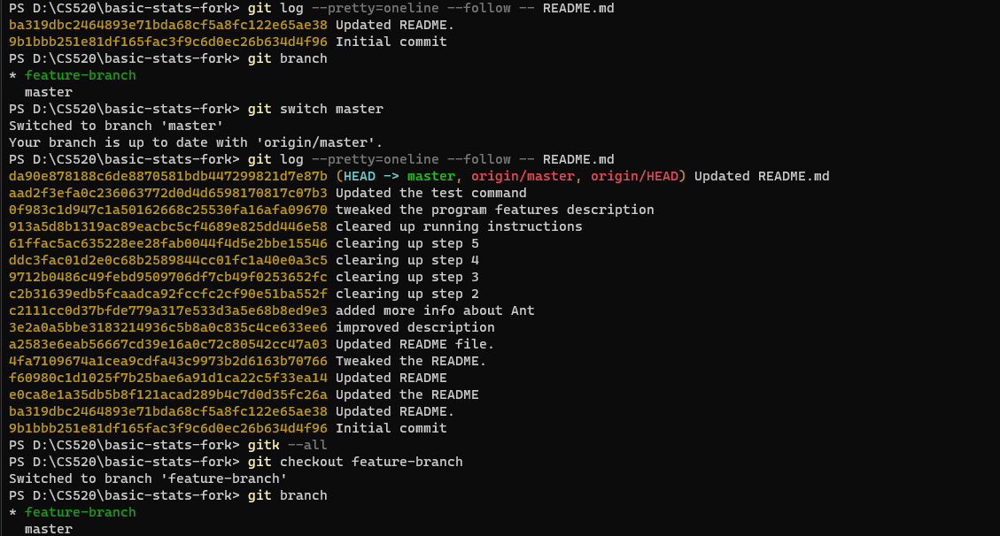
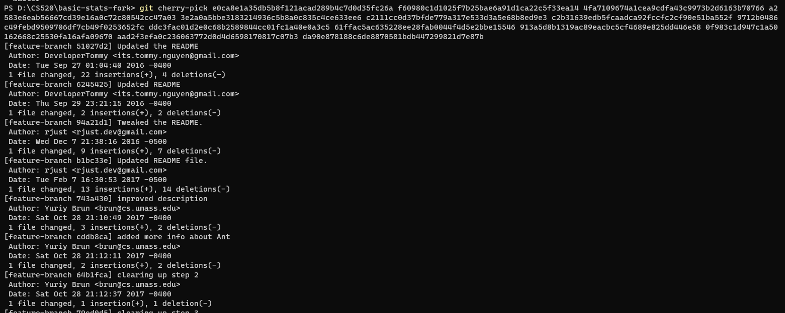

# Questions
Using your notes and results, answer the following questions. Some questions have multiple parts, answer each parts for full score.

1. Include the answers to the 6 queries from Section 1.
**Solutions:**

    1. The number of commits the `README.md` file has is 16. This is can be checked using the following command 

    ```
    git log --pretty=oneline --abbrev-commit --follow README.md | wc -l
    ```

    2. The number of distinct authors is 4. The is can be checked using the following command
    
    ```
    git log --follow --pretty=format:"%an" README.md | sort | uniq | wc -l
    ```

    3. The hash of the commit is `c2111cc0d37bfde779a317e533d3a5e68b8ed9e3`. To get this, the command is 

    ```
    git log -i --grep="ant" master -- README.md
    ```

    4. The number of total commits is 98, where we get this number by this command `git rev-list --all --count`. 


    5. Using this command `git show --name-only 01da475`, we get the following files modified in the commit with the given hash: 

    ```
    src/Models/Model.java
    src/Models/Numbers.java
    src/Views/AddNumView.java
    src/Views/MeanView.java
    src/Views/MedianView.java
    src/Views/ModeView.java
    src/Views/NumbersView.java
    src/Views/ResetView.java
    ```

    6. The most recent commit is 

    ```
    commit da90e878188c6de8870581bdb447299821d7e87b (HEAD -> master, origin/master, origin/HEAD)
    Author: René Just <rjust@users.noreply.github.com>
    Date:   Tue Oct 31 17:48:49 2017 -0400

        Updated README.md
    ```

    where we get the output using the command `git log main -1`


2. Detail the comprehensive procedure for adding a file named MinMaxCalculation.java to a remote Git repository. Your answer should cover the following key areas:

3. How many commits did you cherry-pick? Are the commit hashes of the cherry-picked commits identical in main and feature-branch? Briefly explain why.
**Solutions:**
    - We cherry-pick 14 commits
    
    Firstly, we use ``` git log --pretty=oneline --follow -- README.md ``` in `feature-branch` to find commits affect `README.md` and do the same thing in `master` branch. After that, we chose those from `master` that do not already exist in `feature-branch`. 
    
    Finally we use command `git cherry-pick` with those commit hash to execute cherry-pick.


    - The commit hashes of the cherry-picked commits are different in `master` and `feature-branch`.
    Since Git will create new commits for the target branch and generate a new hash for it. The hash value is 
    based on content metadata and author, which leads to a different hash value.

4. What happens if you merge a branch from which you previously cherry-picked single commits? How
often do the cherry-picked commits appear in the history? Briefly explain why.
